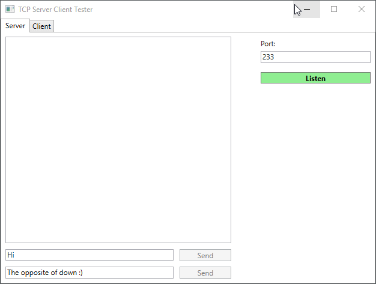

# TCP_Server_Client_Tester (outdated README)
This windows program can be used for testing TCP servers and clients. It also works as an example project for my [TcpConnection_Lib](https://github.com/dadul96/TcpConnection_Lib).

### Installation
There is no installation required. Just download the **TCP_Server_Client_Tester.exe** and the **TcpConnection_Lib.dll** (from [Releases](https://github.com/dadul96/TCP_Server_Client_Tester/releases)) and double-click the exe.

### Requirements
.NET Framework version 4.7.2 or higher

### Built With
* [Visual Studio 2019](https://visualstudio.microsoft.com/) - IDE used for programming
* [.NET](https://dotnet.microsoft.com/download/dotnet-framework) - Framework version 4.7.2 used
* [WPF](https://docs.microsoft.com/en-us/dotnet/framework/wpf/) - Framework used for creating the GUI
* [TcpConnection_Lib](https://github.com/dadul96/TcpConnection_Lib) - C# library that contains the TCP connection handling

| **TcpConnection_Lib-versions**                                             	|     	| **TCP_Server_Client_Tester-versions**                                             	|
|---------------------------------------------------------------------------	|-----	|----------------------------------------------------------------------------------	|
| [v1.0.0](https://github.com/dadul96/TcpConnection_Lib/releases/tag/v1.0.0) 	| <- 	| [v1.0.0](https://github.com/dadul96/TCP_Server_Client_Tester/releases/tag/v1.0.0) 	|
| [v2.0.0](https://github.com/dadul96/TcpConnection_Lib/releases/tag/v2.0.0) 	| <- 	| [v2.0.0](https://github.com/dadul96/TCP_Server_Client_Tester/releases/tag/v2.0.0) 	|

### Author
**Daniel Duller** - [dadul96](https://github.com/dadul96)

### License
This project is licensed under the MIT License - see the [LICENSE](LICENSE) file for details
